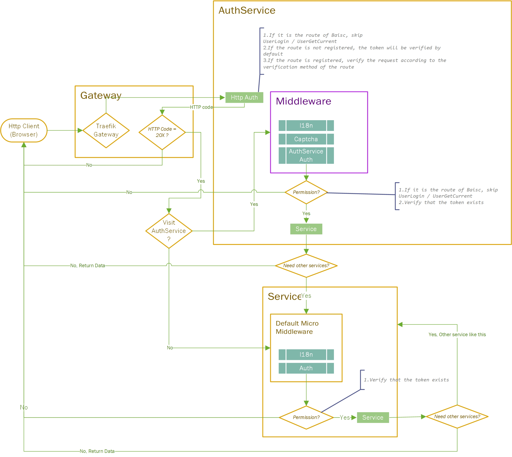

# Etpmls-Micro

Englsih | [简体中文](./README_zh-CN.md)

## In Principle

Etpmls belongs to an organization, not an individual. The project needs more developers to have a future, and we eagerly hope that you can join us.

1. Don't cheat, don't brush star, and would rather nobody use it than fake
2. No cult of personality, every developer is equal, no matter their level is good or bad
3. Swearing is welcome. If you feel that we are not writing well, you can scold it. We like negative comments because it allows us to see ourselves clearly.
4. Developers are highly democratic, voting to determine the future of the project, and the minority obeys the majority, even if you want to `rm -rf /`
5. Born for interest
6. Take open source, repay open source

## Prerequisites

Before using, please make sure you meet the required skills of the framework

1. Have the foundation of Protobuf
2. Have a foundation of Go
3. Have a foundation of Docker

## Introduction
Etpmls-Micro (EM for short) is a micro-service framework, using this framework can quickly develop your micro-service applications in a short time.This project is developed based on Grpc+Grpc Gateway.

>We recommend that you use the following items together to facilitate rapid development of your application.
>
>[EM-Auth](https://github.com/Etpmls/EM-Auth): The main control center, which integrates RBAC0 authentication of users, roles and permissions, custom menus, cache clearing, disk cleaning and other functions
>
>[EM-Attachment](https://github.com/Etpmls/EM-Attachment): Attachment center, used to process attachments of various microservices.



## Version Description

Our version format is: vA.B.C,

If your EM version is different from the latest version only `C`, then you can upgrade directly without hesitation.

If your EM version is only `B` different from the latest version, then you may need to pay attention to the upgrade manual, because we may have some changes, and of course we will try to control the compatibility of the higher version.

If your EM version differs from the latest version only by `A`, it means that the version has been updated or refactored. You should consider whether to upgrade to the latest version.

> We try our best to focus on high compatibility and small changes to reduce the learning cost of users

## Installation
Install with go mod
```go
import "github.com/Etpmls/Etpmls-Micro/v2"
```

## Quick start

### Explanation

```go
// Etpmls-Micro/example/main.go
package main

import "github.com/Etpmls/Etpmls-Micro/v2"

func main()  {
	var reg = em.Register{
		GrpcServiceFunc: RegisterRpcService,
		HttpServiceFunc: RegisterHttpService,
		RouteFunc:       RegisterRoute,
	}
	reg.Init()
	reg.Run()
}
```
This is the simplest application. You only need to implement three methods to successfully register a microservice application.

`RegisterRpcService`: Implement RPC service

`RegisterHttpService`: Implement HTTP service

`RegisterRoute`: Implement routing

### Run

A example has been included in the EA directory,This is one of the most condensed examples to facilitate your understanding.

Enter Etpmls-Micro/example and execute

```shell
go run main.go
```

Enter http://localhost:8081/hello in the browser, and you will find the example returns world.

> This example does not contain any services, only one HTTP route.

## Directory specification

> Please note that the storage directory must fully comply with EM's naming conventions. The naming requirements for other directories are not mandatory. If you don't like our catalog conventions, you can skip this chapter.

We do not have strict catalog specifications. You can completely define your catalog names (except for storage catalogs), but we recommend that you use our catalog specifications. Standardization of catalog names will help improve reading experience and improve the reading efficiency of other developers .

```
# The storage directory must comply with EM's naming convention
/storage
|______/config
|______/language
|______/log
|______/menu
|______/upload

# The following directory naming is not mandatory, but it is recommended that you use it like this
/src
|______/application
|______|______/client
|______|______/database
|______|______/middleware
|______|______/model
|______|______/protobuf
|______|______|______proto
|______|______/service

|______/register
```

`/storage`: **[Name cannot be modified]** The directory where files that do not need to be compiled are stored

`/storage/config`: **[Name cannot be modified]** to store application configuration files

`/storage/language`: **[Name cannot be modified]** to store multi-language files

`/storage/log`: **[Name cannot be modified]** to store log files

`/storage/menu`: **[Name cannot be modified]** json file storing front-end custom menu, usually EM-Auth needs this directory, other microservice applications do not need to create this directory

`/storage/upload`: The directory to store upload attachments, usually EM-Attachment needs this directory, other microservice applications do not need to create this directory

> The following directory naming is not mandatory, but it is recommended that you use it like this
> /src

`/src`: source code is placed in this directory

`/src/application`: business logic, function

`/src/application/client`: interact with other microservices and request other microservices as a client

`/src/application/database`: database field definition

`/src/application/middleware`: custom middleware

`/src/application/model`: model, which handles the business logic of the service

`/src/application/protobuf`: The file storage location after Protobuf compilation

`/src/application/protobuf/proto`: File storage location before Protobuf compilation

`/src/application/service`: It is equivalent to the controller in MVC, processing service requests

`/src/application/service.go`: Define some declarations specific to the service (such as constants, variables)

`/src/register`: registration logic (such as registering routes, registering middleware, registering databases, etc.)

## Environment setup

This project needs to combine Traefik (gateway) and Consul (service discovery), and only post the relevant file code for the construction, and will not explain the detailed principles in detail. For specific details, please refer to the official documents. [Traefik](https://doc.traefik.io/) [Consul](https://www.consul.io/docs)

Create a folder to store docker-compose, this article uses `.` to represent the current directory

> ./docker-compose.yml

```yaml
version: '3'
    
services:
  traefik:
    # The official v2 Traefik docker image
    image: traefik:v2.4
    environment:
    - TZ=Asia/Shanghai
    # Enables the web UI and tells Traefik to listen to docker
    command: --api.insecure=true --providers.docker
    ports:
      # The HTTP port
      - "80:80"
      # The Web UI (enabled by --api.insecure=true)
      - "8080:8080"
      - "443:443"
    restart: on-failure
    volumes:
      # So that Traefik can listen to the Docker events
      - /var/run/docker.sock:/var/run/docker.sock
      - ./traefik:/etc/traefik
    networks:
      em:
       ipv4_address: [##Define the IP address of traefik, such as 10.0.0.2##]
      
  consul:
    image: consul:1.8.5
    volumes:
      - ./consul/data:/consul/data
    ports:
      - "8300:8300/tcp"
      - "8301:8301/udp"
      - "8302:8302/udp"
      - "8500:8500/tcp"
      - "53:8600/udp"
    restart: on-failure
    networks:
      em:
       ipv4_address: [##Define the IP address of consul, such as 10.0.0.2##]
       
networks:
 em:
  ipam:
   driver: default
   config:
    - subnet: "[##Define the gateway address, such as 10.0.0.0/24##]"
```

> ./trafik/traefik.yaml

```yaml
api:
  dashboard: true
 
entryPoints:
  web:
    address: ":80"
    http:
      redirections:
        entryPoint:
          to: websecure
          scheme: https
  websecure:
    address: ":443"
    forwardedHeaders:
     trustedIPs:
     - "[##Fill in the gateway address you defined, such as 10.0.0.0/24##]"
  dashboard:
    address: ":8080"

providers:
  file:
    directory: /etc/traefik/config
  consulCatalog:
   refreshInterval: 30s
   prefix: em
   endpoint:
    address: [##Define the address and port of consul, such as 10.0.0.3:8500##]


certificatesResolvers:
  myresolver:
    acme:
      email: [##Email, used to obtain SSL certificate##]
      storage: acme.json
      httpChallenge:
        entryPoint: web
        
log:
  filePath: "/etc/traefik/log/error.log"
  format: "json"
  level: WARN
accessLog:
  filePath: "/etc/traefik/log/access.log"
  format: "json"
  bufferingSize: 100
```

> ./traefik/config/dashboard.yaml

```yaml
http:
 routers:
  dashboard:
   entryPoints:
   - "dashboard"
   rule: (PathPrefix(`/api`) || PathPrefix(`/dashboard`))
   service: api@internal
   middlewares:
    - auth

 middlewares:
  auth:
   basicAuth:
    users:
    - "admin:$apr1$sadEhKwW$BNpyOakcbLp/P7JyP5ghs0"     # admin admin
```

> ./traefik/config/em.yaml

```yaml
http:
 routers:
  em-template:
    entryPoints:
    - "web"
    - "websecure"
    rule: "Host(`[##Fill in the website domain name, such as google.com##]`)"
    service: em-template
    middlewares:
     - rateLimit
    tls: 
     certResolver: myresolver

 middlewares:
  forwardAuth:
   forwardAuth:
    address: "[##Fill in the address defined by traefik + the address for authorization verification, such as https://10.0.0.2/api/checkAuth##]"
    tls:
     insecureSkipVerify: true
  rateLimit:
   rateLimit:
    average: 1000
    period: 10s
    burst: 2000
  circuitBreaker_em-auth:
   circuitBreaker:
    expression: "NetworkErrorRatio() > 0.30 || LatencyAtQuantileMS(50.0) > 3000"
  circuitBreaker_em-attachment:
   circuitBreaker:
    expression: "NetworkErrorRatio() > 0.30 || LatencyAtQuantileMS(50.0) > 3000"
       
 services:
  em-template:
   loadBalancer:
    servers:
    - url: "[##Define the front-end address, such as http://192.168.3.225:9527/##]"
```

Run docker-compose

```shell
docker-compose up -d
```

## Configuration

### EM Configuration

EM needs to configure two files, one is environment variable configuration, the other is application configuration

#### Environment Variable Configuration

> .env

```
DEBUG="FALSE"
INIT_DATABASE="FALSE"
```

You can refer to the .env.example file to configure.

`DEBUG:`

Whether to enable debugging mode. (TRUE/FALSE), If you fill in FALSE, the **storage/config/app.yaml**  file is read by default, If you fill in TRUE, the **storage/config/app_debug.yaml**  file is read by default

`INIT_DATABASE:`

> The default is False, if you want to enable this feature, you need to register DatabaseMigrate in em.Register

Whether to initialize the database (TRUE/FALSE),

it is recommended to use it when deploying EA for the first time.

If this mode is turned on, initialization data will be automatically inserted into the database.

Do not turn on this mode when data already exists!

#### Application configuration

You need to create two files **app.yaml** (production environment configuration) and **app_debug.yaml** (debug environment configuration) under the storage/config folder. Which file the application uses depends on the value of your environment variable `DEBUG`.

You can refer to the app.yaml.example file to configure.

> The configuration example of Etpmls-Micro/file/app.yaml.example in the EM framework source code is always the latest. If you plan to upgrade from a lower version to a higher version of the EM framework, please copy the latest configuration file example from EM to your project.

### Gateway configuration

The gateway of this project uses Traefik as an example, and service discovery uses Consul as an example. If you want to integrate the gateway and service discovery, you need to configure the gateway.

> Traefik official reference article
>
> https://doc.traefik.io/traefik/providers/consul-catalog/
>
> https://doc.traefik.io/traefik/routing/providers/consul-catalog/

We need to write the relevant configuration in the service-discovery.service.rpc/http.tag of the `storage/config/app[_debug].yaml` file. We provide an example for reference, and you can modify it directly on this basis.

```yaml
      tag: [
        "em.http.routers.[YOUR_SERVICE_NAME].entrypoints=web,websecure",
        "em.http.routers.[YOUR_SERVICE_NAME].rule=Host(`[YOUR_DOMAIN]`) && PathPrefix(`[YOUR_SERVICE_ROUTE_PATH]`)",
        "em.http.routers.[YOUR_SERVICE_NAME].tls.certresolver=myresolver",
        "em.http.routers.[YOUR_SERVICE_NAME].middlewares=circuitBreaker_em-attachment@file,forwardAuth@file",
        "em.http.routers.[YOUR_SERVICE_NAME].service=[YOUR_SERVICE_NAME]",

        "em.http.services.[YOUR_SERVICE_NAME].loadbalancer.passhostheader=true",
      ]
```

> [YOUR_DOMAIN]

Replace with your domain name

> [YOUR_SERVICE_ROUTE]

Replace with your service path, such as /api/attachment/

> [YOUR_SERVICE_NAME]

Replace with your service name